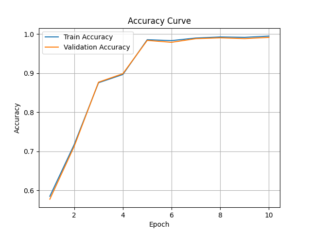
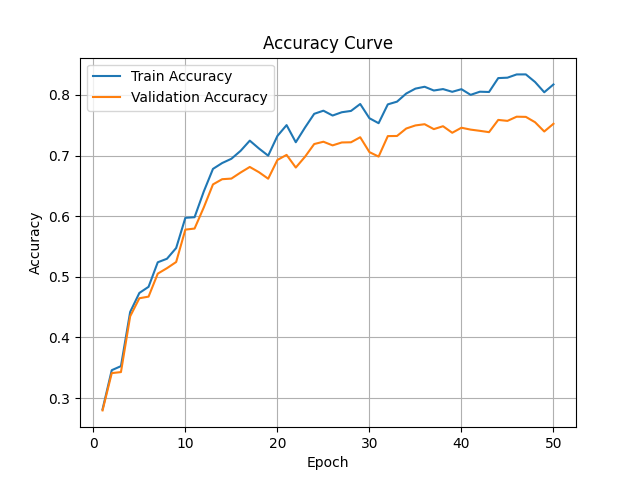

# No-Propagation Diffusion Transformer (NoPropDT) on MNIST

This repository contains a clean and complete PyTorch implementation of the **No-Propagation Diffusion Transformer (NoPropDT)** model as described in the paper by researchers from the University of Oxford.
Paper Link:
https://arxiv.org/pdf/2503.24322

---

## 🚀 Purpose

The goal of this project was to go **from scratch to paper-accurate** implementation of the No-Propagation learning algorithm — a backpropagation-free method for training deep models using local layer-wise targets and diffusion-based denoising.

This implementation specifically focuses on MNIST to replicate the experimental setup shown in the original paper and validate that the model can reach high accuracy using purely local updates.

---

## 💡 Intuition

Traditional neural networks use backpropagation to update weights layer by layer using gradients. While powerful, it's:

* Biologically implausible
* Not memory efficient
* Hard to parallelize layer-wise

NoPropDT replaces backprop with a stack of **denoising blocks**. Each block performs a denoising operation that refines a noisy class embedding toward the correct label embedding. The entire network learns through **sample reuse and local MSE** — not gradients passed through the whole network.

The intuition:

* Start with a noisy guess for class embedding.
* Use CNN + MLP blocks to clean (denoise) it toward the correct label.
* Repeat this T times.
* At the end, classify the denoised embedding with a linear head.

---

## 🧠 How the Codebase Works

The code is modular and broken into clear parts:

### 1. `models/no_prop_dt.py`

Defines the **NoPropDT model**:

* `DenoiseBlock`: CNN + MLP that processes image + noisy embedding
* `NoPropDT`: Stack of denoising blocks + classifier + cosine noise schedule

### 2. `trainer/train_nopropdt.py`

* Trains the model using **layer-wise local losses** (no backprop)
* Final step uses cross-entropy + KL for stability
* Evaluates accuracy at each epoch

### 3. `data/mnist_loader.py`

* Loads MNIST dataset with `ToTensor()`
* Returns train/test DataLoaders

### 4. `experiments/run_mnist_dt.py`

* Loads data, builds model, sets hyperparams, calls trainer
* Clean separation for future dataset extensions

### 5. `main.py`

* Entrypoint script that runs the MNIST experiment

### 🔄 Code Flow Diagram:

```
main.py
 └─→ run_mnist_dt.py
     ├─→ get_mnist_loaders() → data/mnist_loader.py
     ├─→ model = NoPropDT(...) → models/no_prop_dt.py
     └─→ train_nopropdt(...) → trainer/train_nopropdt.py
```

---

## ✅ Results

On MNIST, the model achieves **~99% validation accuracy by epoch 7**, matching or exceeding what the paper reports.  
On CIFAR-10, it reaches **~76% validation accuracy by epoch 50**, outperforming earlier linear-only setups.

### 📊 Accuracy Comparisons

<table>
  <tr>
    <td><b>MNIST</b><br><sub>No Decoder</sub><br></td>
    <td><b>MNIST</b><br><sub>With Nonlinear Decoder</sub><br></td>
  </tr>
  <tr>
    <td><b>CIFAR-10</b><br><sub>No Decoder</sub><br></td>
    <td><b>CIFAR-10</b><br><sub>With Nonlinear Decoder</sub><br></td>
  </tr>
</table>

And all of this is done **without using backpropagation**.

🤝 How to Contribute

Want to experiment with this or try on your own dataset? Here's how to get started:

Clone the repo:

git clone https://github.com/ANKITSANJYAL/NoPropagation.git
cd NoPropagation

Add a custom dataset loader under data/ (check mnist_loader.py or cifar_loader.py as reference)

Write a training script under experiments/ (copy run_mnist_dt.py or run_cifar_dt.py)

Adjust the model config (e.g. num_input_channels, num_classes, embedding_dim) in the script

Run your experiment:

PYTHONPATH=. python experiments/your_script.py

This codebase is modular by design — you can plug in new datasets, decoders, schedulers, or compare against backprop baselines.

Open a PR if you add a new experiment, optimizer, or decoder variant. Let's keep improving this together.

🔭 Next Steps for Me

So far:

✅ MNIST baseline and decoder versions implemented

✅ CIFAR-10 baseline and decoder version trained

Coming up:

Add support for SVHN and TinyImageNet

Add backprop baselines for direct comparison

Integrate WandB tracking for better logs and visualizations

Try alternative denoising blocks or noise schedules

(Optional) Benchmark memory + training speed vs traditional backprop


---

Thanks for checking out the project — if you're into optimization, bio-inspired learning, or just curious about alternatives to backprop, you’ll enjoy digging into this.

PRs and stars are always welcome :)

---
## 🙏 Credits

This implementation was restructured and extended from a notebook version shared by the community. Special thanks for the inspiration!
https://github.com/ashishbamania/Tutorials-On-Artificial-Intelligence/blob/main/Training%20Without%20Backpropagation/NoPropDT_on_MNIST.ipynb
